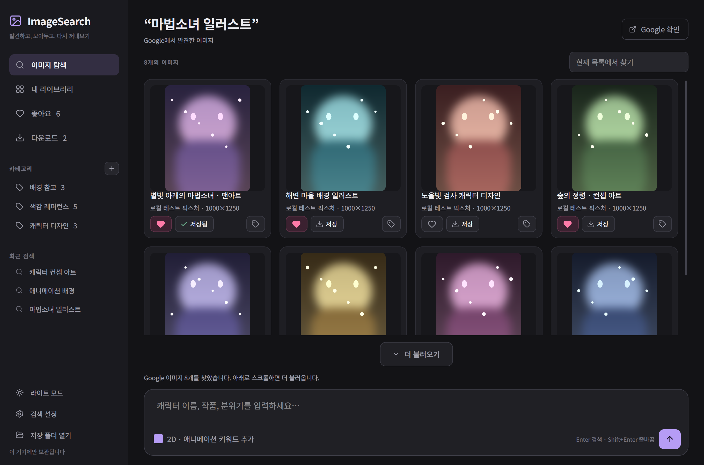
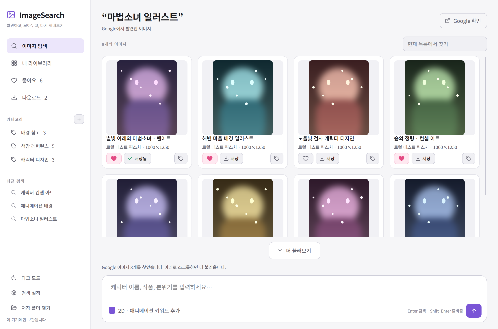
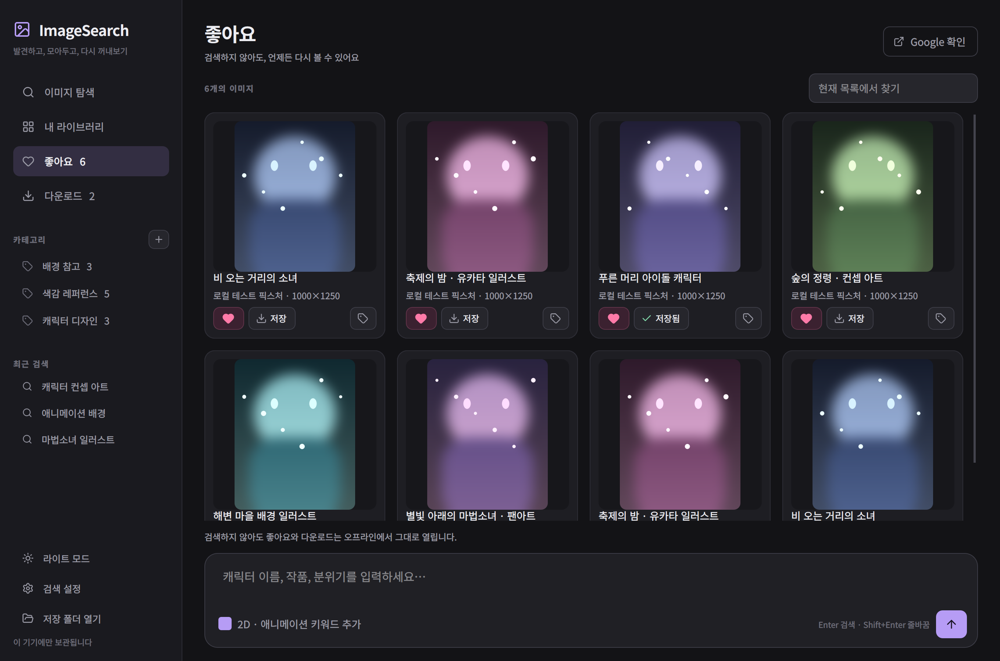

<div align="center">

# ImageSearch

### 찾고 싶은 캐릭터, 한 줄로 검색해보세요.

좋아하는 이미지를 **원본 화질 그대로** 발견하고, 모아두고, 언제든 다시 꺼내보세요.<br>
Google 이미지 검색부터 좋아요, 다운로드, 카테고리 정리까지 하나의 데스크톱 앱에서.

[다운로드](#다운로드하고-시작하기) · [사용 가이드](docs/USER_GUIDE.md) · [개발 가이드](docs/DEVELOPMENT.md) · [개인정보](docs/PRIVACY.md)



</div>

---

## 이런 순간에 사용해보세요

> **“마법소녀 일러스트를 찾고 싶어요.”**
> 화면 아래 채팅창에 키워드를 입력하고 Enter. 결과가 준비되면 가져오기 버튼을 누를 필요 없이 위쪽에 카드로 펼쳐집니다.

> **“한 페이지로는 부족해요.”**
> 아래로 스크롤하면 Google의 다음 이미지들을 이어서 불러옵니다. 직접 누르고 싶다면 **더 불러오기** 버튼도 있습니다.

> **“썸네일 말고 진짜 화질로 보고 싶어요.”**
> 미리보기부터 검색 결과의 **원본 이미지**를 받아옵니다. Retina 화면에서도 픽셀 밀도에 맞춰 그려서 흐릿하지 않습니다.

> **“다시 검색하지 않고 보고 싶어요.”**
> 마음에 드는 이미지의 하트를 누르세요. 저장된 미리보기는 인터넷 없이도 좋아요 목록에서 다시 열립니다.

> **“작품마다 모아두고 싶어요.”**
> `캐릭터 디자인`, `배경 참고`, `색감 레퍼런스`처럼 카테고리를 만들고, 이미지 하나를 여러 곳에 함께 분류하세요.

---

## 무엇이 좋아졌나요 (1.1.0)

| | 이전 | 지금 |
|---|---|---|
| **화질** | Google 썸네일(약 250px)을 캐시 | **원본 이미지**를 받아 최대 1600px로 보관, 작은 원본은 무손실 그대로 |
| **선명도** | 논리 좌표로 축소해 Retina에서 절반 해상도 | 화면 픽셀 비율(devicePixelRatio)에 맞춰 렌더링 |
| **결과 수** | 첫 화면에 로드된 것만 | 스크롤·더 불러오기로 **최대 500장**까지 이어서 수집 |
| **아이콘** | `♡ ↓ ＋` 텍스트 문자 | [Lucide](https://lucide.dev) SVG 아이콘, 테마 색상으로 렌더링 |
| **반응** | 정적 | 좋아요 팝 애니메이션, 저장 스피너와 완료 팝, 이미지 페이드인 |
| **테마** | 다크 고정 | **라이트 / 다크 전환**, 선택은 다음 실행에도 유지 |
| **네트워크** | 결과 전체의 미리보기를 한 번에 요청 | 화면에 보이는 카드만 지연 로딩 |

<div align="center">


<sub>사이드바의 **라이트 모드 / 다크 모드** 또는 <kbd>Ctrl</kbd>+<kbd>T</kbd> 로 전환합니다.</sub>

</div>

---

## 주요 기능

| 기능 | 어떻게 동작하나요? |
|---|---|
| 채팅처럼 검색 | 하단 입력창에 캐릭터·작품·분위기를 적고 Enter |
| 자동 결과 표시 | Google 결과를 읽으면 이미지 카드로 자동 표시 |
| 이어서 불러오기 | 목록 끝으로 스크롤하면 다음 결과를 자동 수집 (최대 500장) |
| 원본 화질 미리보기 | 썸네일이 아닌 원본에서 미리보기를 생성, 실패할 때만 썸네일로 대체 |
| 2D 검색어 보강 | 선택 시 애니메이션·일러스트 검색어를 함께 추가 |
| 좋아요 | 재실행 후에도 목록 유지, 저장된 미리보기는 오프라인에서 열람 |
| 원본 다운로드 | 백그라운드 저장, 다운로드 목록과 파일 열기, 저장한 파일에서 미리보기 재사용 |
| 카테고리 | 생성·이름 변경·삭제, 이미지 하나를 여러 카테고리에 지정 |
| 라이트/다크 테마 | 사이드바 버튼 또는 <kbd>Ctrl</kbd>+<kbd>T</kbd>, 설정은 로컬 DB에 저장 |
| 빠르게 다시 찾기 | 최근 검색, 현재 목록 필터, 확대 미리보기, 원본 출처 열기 |
| 로컬 라이브러리 | 이미지 목록과 저장 파일을 각 사용자의 기기에만 보관 |

> **검색에 대해 솔직하게:** 이 앱은 Google 이미지 결과 페이지를 앱 안의 Chromium으로 열어 읽습니다. Google이 CAPTCHA나 동의를 요구하면 `Google 확인`을 눌러 직접 처리해야 하며, 확인 뒤에는 결과를 자동으로 가져옵니다. **인증을 자동으로 우회하지 않습니다.** 네트워크 차단이나 Google 페이지 구조 변경으로 검색이 실패할 수 있으며, 모든 환경에서 무인 검색을 보장하지 않습니다. 반복된다면 검색 설정에서 본인의 SerpApi 키를 연결할 수 있습니다.

---

## 다운로드하고 시작하기

### 1. 배포된 앱으로 (macOS)

1. **[Releases](../../releases)** 에서 최신 `ImageSearch-macos-*.zip` 을 내려받습니다.
2. 압축을 풀고 `ImageSearch.app` 을 응용 프로그램 폴더로 옮깁니다.
3. 앱을 열고 하단 검색창에 키워드를 입력하세요.

앱은 Apple 공증을 받지 않았습니다. macOS가 실행을 막으면 다운로드 출처를 확인한 뒤 **시스템 설정 → 개인정보 보호 및 보안**에서 해당 앱의 실행 허용 항목을 확인하세요. 시스템 보안 기능 전체를 끌 필요는 없습니다.

Windows·Linux 배포 파일은 제공하지 않습니다. 아래 소스 실행 방법을 사용하세요.

### 2. 소스로 실행하기 (macOS · Windows · Linux)

Python 3.10 이상이 필요합니다. 개발·검증은 Python 3.11과 3.13에서 수행했습니다.

```sh
git clone https://github.com/warumnicht1915/googleai.git
cd googleai
python3 -m venv .venv
.venv/bin/python -m pip install -r requirements.txt
.venv/bin/python main.py
```

macOS에서는 `run.command` 를 더블클릭해도 됩니다. Windows는 `run.bat` 또는 다음 명령을 사용하세요.

```powershell
py -3 -m venv .venv
.venv\Scripts\python.exe -m pip install -r requirements.txt
.venv\Scripts\python.exe main.py
```

### 3. 직접 앱으로 빌드하기

```sh
.venv/bin/python -m pip install -r requirements-dev.txt
.venv/bin/python scripts/build.py     # macOS → dist/ImageSearch.app
```

---

## 30초 사용 가이드

<div align="center">



</div>

1. **검색** — 하단 입력창에 키워드를 넣고 <kbd>Enter</kbd>. <kbd>Shift</kbd>+<kbd>Enter</kbd> 는 줄바꿈입니다.
2. **더 보기** — 목록 끝까지 스크롤하거나 **더 불러오기** 를 누르면 다음 결과가 이어집니다.
3. **좋아요** — 카드의 하트를 클릭. 왼쪽 **좋아요** 에서 언제든 다시 열립니다.
4. **다운로드** — **저장** 클릭. 완료 후 **저장됨** 을 누르면 파일이 열립니다.
5. **분류** — 카드 오른쪽 태그 버튼으로 카테고리 선택. 왼쪽 `＋` 로 새 카테고리를 만듭니다.
6. **확대** — 이미지를 클릭하면 큰 미리보기와 **원본 출처** 링크가 열립니다.
7. **테마** — 사이드바에서 라이트/다크 전환 (<kbd>Ctrl</kbd>+<kbd>T</kbd>).

| 단축키 | 동작 |
|---|---|
| <kbd>Ctrl</kbd>+<kbd>L</kbd> | 검색창으로 포커스 |
| <kbd>Ctrl</kbd>+<kbd>T</kbd> | 라이트/다크 전환 |
| <kbd>Ctrl</kbd>+<kbd>1</kbd> / <kbd>2</kbd> / <kbd>3</kbd> | 탐색 / 좋아요 / 다운로드 |

상단 검색칸은 **현재 목록 필터**, 하단 입력창은 **새 Google 검색**입니다. `2D · 애니메이션 키워드 추가` 는 검색어를 보강하는 옵션이며 AI 이미지 분류 기능은 아닙니다.

---

## 내 데이터는 어디에 저장되나요?

| 운영체제 | 기본 저장 위치 |
|---|---|
| macOS | `~/Library/Application Support/ImageSearch/` |
| Windows | `%LOCALAPPDATA%\ImageSearch\` |
| Linux | `$XDG_DATA_HOME/imagesearch/` 또는 `~/.local/share/imagesearch/` |

앱의 **저장 폴더 열기** 로 바로 접근할 수 있습니다. 앱을 완전히 종료한 뒤 폴더 전체를 복사하면 백업됩니다.

**배포 파일에는 개발자의 계정, 개인 라이브러리, 브라우저 프로필, 검색 기록, API 키가 포함되지 않습니다.** 검색어는 Google 또는 선택한 SerpApi로 전송되며, 이미지는 해당 이미지 서버에서 다운로드합니다. 앱 자체 계정이나 클라우드 동기화는 없습니다. 자세한 내용은 [개인정보 안내](docs/PRIVACY.md)를 확인하세요.

---

## 프로젝트 구조

```text
googleai/
├── main.py                     # 앱 진입점, 아이콘, 중복 실행 방지
├── imagesearch/
│   ├── ui.py                   # 사이드바, 검색창, 카드, 애니메이션, 지연 로딩
│   ├── search.py               # Google 자동 수집, 스크롤 페이징, 선택형 SerpApi
│   ├── network.py              # 원본 우선 이미지 수집과 미리보기 생성
│   ├── store.py                # SQLite 라이브러리 · 카테고리 · 설정
│   ├── theme.py                # 라이트/다크 팔레트와 스타일시트
│   └── icons.py                # Lucide SVG를 테마 색·고해상도 픽스맵으로 렌더링
├── assets/
│   ├── icon.png                # 앱 아이콘
│   └── icons/                  # Lucide 아이콘 세트 (ISC 라이선스 포함)
├── docs/
│   ├── images/                 # 개인 데이터 없이 캡처한 실제 앱 화면
│   ├── USER_GUIDE.md           # 사용법과 문제 해결
│   ├── DEVELOPMENT.md          # 구조, 테스트, 빌드
│   ├── PRIVACY.md              # 데이터 처리 및 공개 전 점검
│   └── VALIDATION.md           # 검증 범위와 알려진 제한
├── scripts/
│   ├── build.py                # PyInstaller 번들 생성
│   ├── capture_ui.py           # 문서용 화면 캡처 (임시 데이터만 사용)
│   ├── verify_search.py        # 통제된 HTML로 추출 로직 검증
│   └── verify_auto_search.py   # 자동 수집 흐름 검증
├── tests/                      # 저장소·네트워크·페이징·테마·UI 회귀 테스트 40개
├── .github/workflows/          # 자동 테스트, macOS 릴리스 빌드
├── requirements*.txt           # 고정 버전 의존성
└── pyproject.toml              # Python 프로젝트 설정
```

### 어떻게 동작하나요

```text
검색어  →  search.py    앱 내 Chromium이 Google 이미지 결과를 열고
                        DOM과 스크립트 튜플에서 원본 URL을 추출
                        스크롤하며 다음 페이지를 이어서 수집 (중복 제거)
        →  store.py     SQLite에 이미지 메타데이터 upsert
        →  ui.py        카드 배치 · 화면에 보이는 카드만 미리보기 요청
        →  network.py   원본 URL 우선 다운로드 → 미리보기 생성 → 로컬 캐시
        →  ui.py        화면 픽셀 비율에 맞춰 렌더링 + 페이드인
```

---

## 개발 및 검증

```sh
.venv/bin/python -m pip install -r requirements-dev.txt
.venv/bin/python -m pytest -q                 # 40 tests
.venv/bin/python scripts/verify_search.py
.venv/bin/python scripts/verify_auto_search.py
.venv/bin/python scripts/capture_ui.py        # docs/images 재생성
```

저장·분류·다운로드·오프라인 재실행에 더해 **원본 우선 미리보기, 해상도 렌더링, 페이징 중복 제거, 지연 로딩, 테마 전환**을 검증하는 테스트 40개가 통과합니다. 검증 범위와 확인하지 못한 항목은 [검증 기록](docs/VALIDATION.md)에 그대로 적어 두었습니다.

---

## 라이선스와 고지

이미지의 이용 조건은 원본 사이트에서 확인하세요. 이 프로젝트는 Google의 공식 제품이 아닙니다.

아이콘은 [Lucide](https://lucide.dev) (ISC License) 를 사용합니다. 제3자 라이브러리의 라이선스 고지는 [THIRD_PARTY_NOTICES.md](THIRD_PARTY_NOTICES.md) 에 있습니다. 프로젝트 자체 소스의 오픈소스 라이선스는 아직 지정하지 않았습니다.
